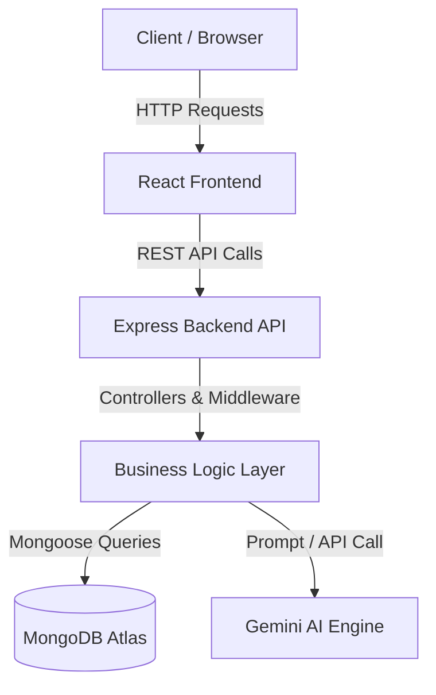
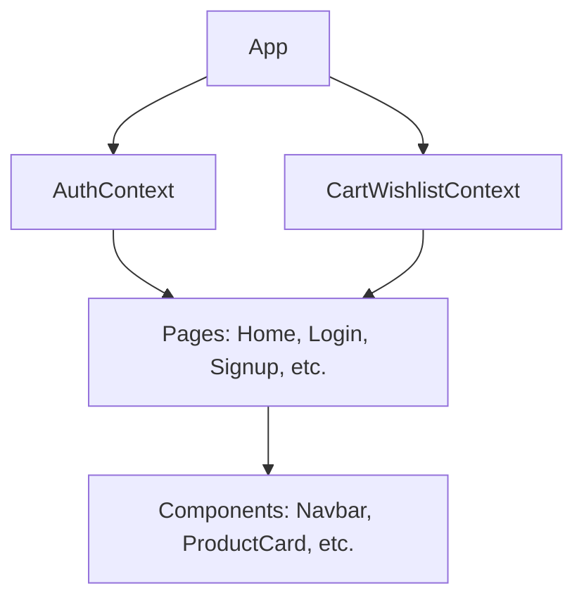
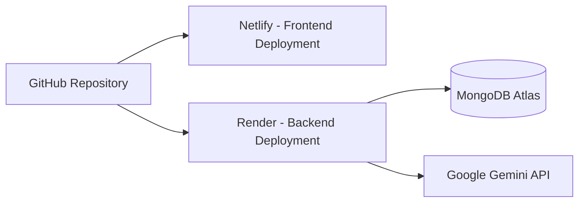

# System Overview
FlipWish is a full-stack e-commerce application utilizing a modern JavaScript/TypeScript stack. It features a React-based frontend and an Express/Node.js backend, backed by MongoDB. The system integrates the Gemini AI for smart product recommendations.

# Technology Stack
**Frontend:**
- React
- TypeScript
- Tailwind CSS
- Context API
- Vite

**Backend:**
- Node.js
- Express
- MongoDB Atlas
- Mongoose
- JWT (JSON Web Tokens)
- bcrypt

**AI Integration:**
- Gemini AI (via `@google/genai`)

**Deployment:**
- Netlify (Frontend)
- Render (Backend)
- MongoDB Atlas (Database)

# Architecture Diagram

# Component Diagram

# Data Flow
User
↓
React (Frontend Interface)
↓
API (Axios / Fetch)
↓
Express (Routes)
↓
Controller (Business Logic)
↓
MongoDB (Mongoose Models)
↓
Response (JSON to Frontend)

# Authentication Flow
1. User submits login credentials.
2. Express backend validates against MongoDB.
3. If valid, backend generates a JWT using a secret key.
4. JWT is sent to the React frontend and stored (e.g., in localStorage).
5. Subsequent API requests include the JWT in the Authorization header.
6. Express middleware verifies the JWT before granting access to protected routes.

# AI Recommendation Flow
1. User triggers a recommendation request (e.g., clicking a button).
2. React frontend sends context (user preferences, current product, or query) to the backend.
3. Express controller constructs a detailed prompt.
4. Backend calls Gemini AI API.
5. Gemini AI returns a structured response (JSON).
6. Backend parses and forwards the recommendations to the frontend.

# Deployment Architecture

# Folder Structure
- `/src`: Contains the React frontend code (components, pages, context, styles).
- `/server`: Contains the Express backend API logic (routes, controllers, middleware, DB connection).
- `/models`: Defines the Mongoose database schemas (User, Product, Wishlist, Cart).
- `/config`: Configuration files for environment variables or database connection.
