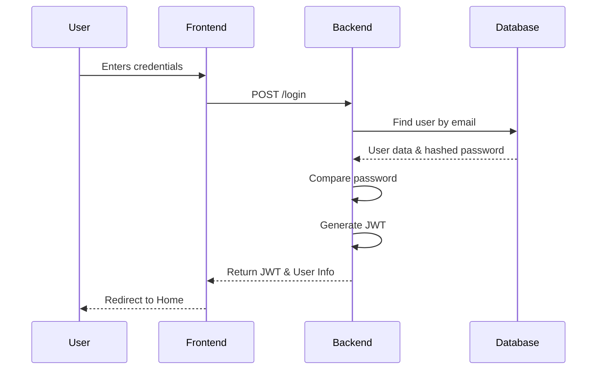
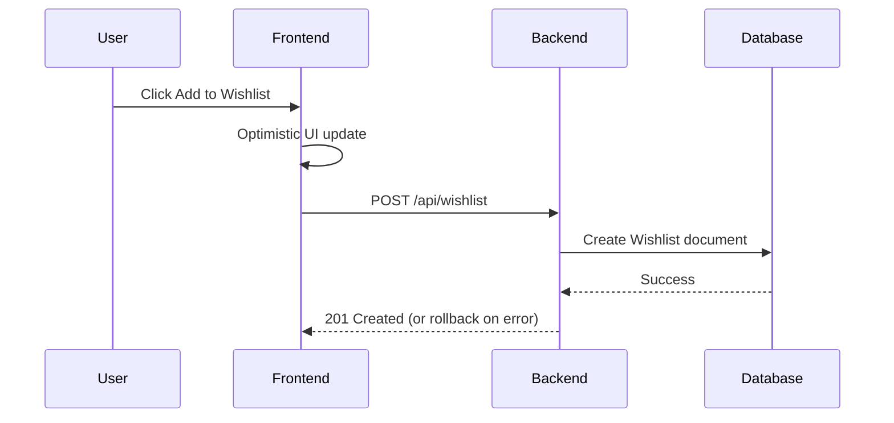
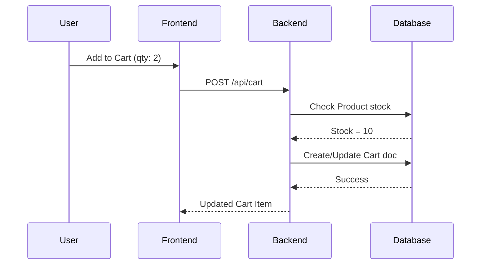
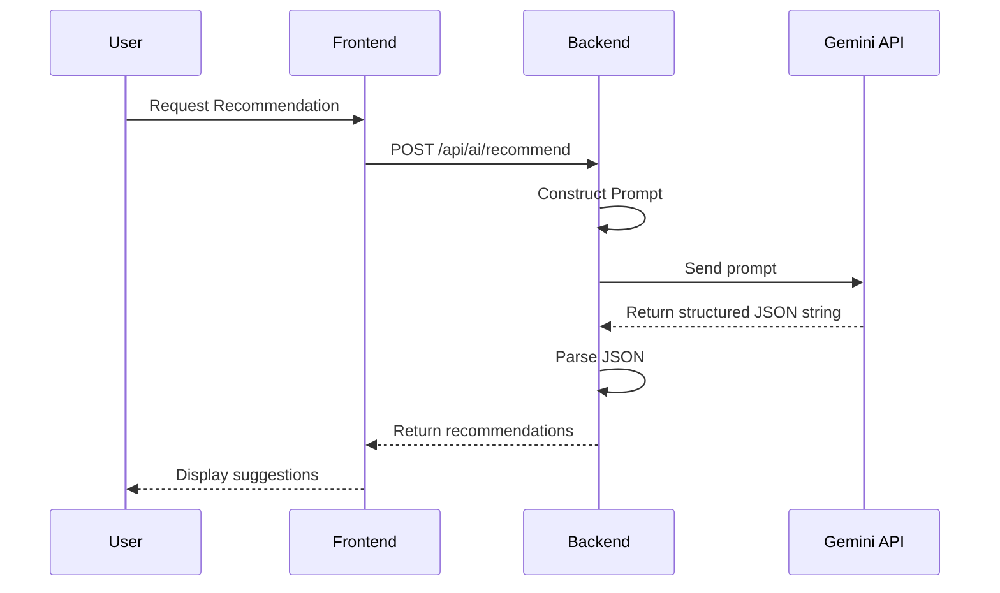

# Folder Structure
- `src/components`: Reusable UI elements (buttons, inputs, cards).
- `src/pages`: Main application views (Home, Login, Signup, Cart, Wishlist, ProductDetails).
- `src/context`: React Context providers for global state management (AuthContext, CartWishlistContext).
- `server/controllers`: Contains functions that handle the business logic for specific routes.
- `server/routes`: Defines API endpoints and maps them to controllers.
- `server/middleware`: Contains functions that intercept requests (e.g., authentication verification, error handling).
- `server/utils`: Helper functions and shared utilities.
- `models`: Mongoose schema definitions mapping to MongoDB collections.

# File Structure
- `server.ts`: The main entry point for the backend, configuring Express, CORS, connecting to MongoDB, and setting up route prefixes.
- `vite.config.ts`: Configuration for Vite, defining plugins and build settings.
- `package.json`: Manages dependencies and defines run scripts (dev, build, start).
- `src/App.tsx`: The root React component that sets up routing and context providers.

# Database Design

**User**
| Field    | Type   | Required | Description |
|----------|--------|----------|-------------|
| name     | String | No       | User's full name |
| email    | String | Yes      | User's unique email address |
| password | String | No       | Hashed password |

**Product**
| Field         | Type    | Required | Description |
|---------------|---------|----------|-------------|
| name/title    | String  | No       | Product title |
| description   | String  | No       | Product description |
| brand         | String  | No       | Brand name |
| category      | String  | No       | Category name |
| price         | Number  | No       | Current price |
| originalPrice | Number  | No       | Price before discount |
| stock         | Number  | No       | Available quantity |
| rating        | Number  | No       | Average rating |
| reviews       | Number  | No       | Number of reviews |
| image         | String  | No       | URL to product image |

**Wishlist**
| Field   | Type     | Required | Description |
|---------|----------|----------|-------------|
| user    | ObjectId | No       | Reference to User |
| product | ObjectId | No       | Reference to Product |

**Cart**
| Field    | Type     | Required | Description |
|----------|----------|----------|-------------|
| user     | ObjectId | No       | Reference to User |
| product  | ObjectId | No       | Reference to Product |
| quantity | Number   | No       | Quantity of the product |

# Relationships
User (1) → (N) Wishlist (1) → (1) Product
User (1) → (N) Cart (1) → (1) Product
*(Referencing using `ObjectId` in Mongoose establishes these relational links between documents.)*

# API Design

**Auth Endpoints**
- `POST /api/auth/register`: Register a new user. Body: `{ name, email, password }`.
- `POST /api/auth/login`: Login user. Body: `{ email, password }`. Returns: JWT and user data.

**Product Endpoints**
- `GET /api/products`: Fetch all products (supports query params for filtering/pagination).
- `GET /api/products/:id`: Fetch a single product by ID.

**Wishlist Endpoints (Requires Auth)**
- `GET /api/wishlist`: Get current user's wishlist.
- `POST /api/wishlist`: Add item to wishlist. Body: `{ productId }`.
- `DELETE /api/wishlist/:id`: Remove item from wishlist.

**Cart Endpoints (Requires Auth)**
- `GET /api/cart`: Get current user's cart.
- `POST /api/cart`: Add item to cart. Body: `{ productId, quantity }`.
- `PUT /api/cart/:id`: Update item quantity. Body: `{ quantity }`.
- `DELETE /api/cart/:id`: Remove item from cart.

**AI Endpoints**
- `POST /api/ai/recommend`: Get AI recommendations based on prompt.

# Controller Design
- **Auth Controller**: Handles password hashing, user creation, password verification, and JWT signing.
- **Product Controller**: Handles querying the database with Mongoose, applying filters, sorting, and pagination logic.
- **Wishlist Controller**: Manages adding/removing items from the user's wishlist, populating product data.
- **Cart Controller**: Manages cart operations, checking stock availability before adding or updating quantities.
- **AI Controller**: Constructs prompts for Gemini, handles API communication, and parses the structured output.

# Middleware
- **Authentication Middleware**: Extracts the JWT from the Authorization header, verifies it, and attaches the user ID to the request object.
- **Error Handling**: Catches unhandled exceptions and returns a standardized JSON error response.
- **CORS**: Configures allowed origins and headers for cross-origin requests.

# JWT Authentication Flow
1. Client sends credentials to `/api/auth/login`.
2. Server verifies and signs a token with a secret.
3. Token returned to client.
4. Client attaches `Bearer <token>` to protected route requests.
5. `authMiddleware` verifies token; if invalid, returns 401 Unauthorized.

# MongoDB CRUD Flow
- **Create**: `Model.create(data)` or `new Model(data).save()`.
- **Read**: `Model.find(query).populate('ref')` or `Model.findById(id)`.
- **Update**: `Model.findByIdAndUpdate(id, data, { new: true })`.
- **Delete**: `Model.findByIdAndDelete(id)`.

# Wishlist Polling Flow
1. Frontend sets up a `setInterval` (e.g., every 30 seconds) in a `useEffect` hook.
2. The interval triggers a fetch request to `/api/wishlist`.
3. Backend retrieves the updated wishlist and populates the latest product data (including stock).
4. Frontend updates the state, reflecting any stock changes immediately.

# Optimistic UI Flow
1. User performs an action (e.g., add to wishlist).
2. Frontend immediately updates the local state to reflect the action (UI feels instantaneous).
3. Background API request is sent.
4. If the request fails, the frontend state is rolled back to its previous state and an error notification is shown.

# Cart Flow
1. User clicks "Add to Cart".
2. Backend checks `Product.stock`. If `requested > stock`, returns error.
3. If stock is sufficient, creates or updates the Cart document.
4. Frontend updates cart count and items.

# Gemini Recommendation Flow
- **Prompt Engineering**: The controller builds a prompt like "Given these user preferences [details], suggest top 3 products from our catalog."
- **Structured Output**: The prompt explicitly requests the response in a specific JSON format. The backend parses `response.text()` into a JSON object before sending it to the frontend.

# Sequence Diagrams

**Login**

**Wishlist**

**Cart**

**AI Recommendation**

# Error Handling
- Use `try...catch` blocks in controllers.
- Return consistent JSON structures: `{ error: true, message: "..." }`.

# Security
- **JWT**: For stateless, secure API authentication.
- **bcrypt**: To hash user passwords before storing in MongoDB.
- **Environment Variables**: Store secrets (DB URI, JWT Secret, Gemini API Key) in `.env`.
- **CORS**: Restrict cross-origin requests to trusted frontend domains.
- **Input Validation**: Check for required fields and valid data types before processing requests.

# Deployment Flow
GitHub
↓ (Auto-deploy on push)
Render (Builds & runs backend API)
↓ (Serves frontend static assets or distinct deploy)
Netlify (Builds & serves React app)
↓ (Backend connects to DB)
MongoDB Atlas

# Design Decisions
- **MongoDB**: Flexible schema design, easily accommodates diverse product attributes.
- **React Context**: Lightweight global state management for Cart/Wishlist without the overhead of Redux.
- **Express**: Fast, minimalist web framework for building REST APIs in Node.js.
- **Gemini**: Advanced LLM capabilities for intelligent, context-aware recommendations.
- **JWT**: Eliminates the need for server-side session storage, aiding in scalability.
- **Mongoose**: Provides robust schema validation and easy relationship mapping (`populate`).
